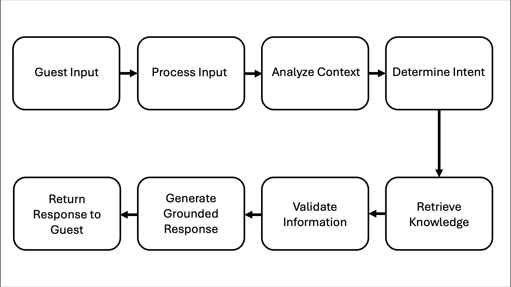

# Hotel Information Agent Documentation

## Overview

The Hotel Information Agent is an AI-powered hospitality assistant built using Azure AI Foundry and GPT-5-mini.

The purpose of the agent is to provide grounded and professional responses to hotel guest inquiries related to:
- hotel amenities
- check-in and check-out
- dining
- parking
- accessibility
- transportation
- reservation policies
- general guest support

The project focuses on conversational reliability, grounded response generation, and professional hospitality interactions.

---

# System Workflow

The following flowchart represents the high-level workflow of the Hotel Information Agent.

---

# Workflow Explanation

## 1. Guest Input
The process begins when a guest submits a question or request to the AI agent.

Examples:
- “What time is check-in?”
- “Does the hotel provide parking?”
- “Can I request early check-in?”

---

## 2. Process Input
The agent processes the guest request using system instructions and conversational context.

This stage includes:
- understanding the request
- analyzing conversation history
- identifying keywords and context

---

## 3. Determine Intent
The AI model determines the guest’s intent.

Examples:
- requesting information
- asking about policies
- asking about amenities
- requesting assistance

---

## 4. Fetch Information or Perform Task
The agent retrieves grounded information from the connected hotel knowledge base.

The agent:
- checks available hotel information
- avoids hallucinating unsupported details
- handles unsupported requests professionally

---

## 5. Generate Response
The AI generates a conversational response for the guest.

The response should be:
- professional
- concise
- grounded
- hospitality-focused

---

# Technologies Used

- Azure AI Foundry
- Azure OpenAI
- GPT-5-mini
- Prompt Engineering
- Knowledge Grounding
- Conversational AI

---

# Agent Objectives

The main objectives of the project are:
- provide grounded hotel information
- reduce hallucinations
- maintain professional guest interactions
- improve conversational reliability
- support hospitality workflows

---

# Demonstration

The repository includes a recorded walkthrough demonstration of the Hotel Information Agent inside Azure AI Foundry.
